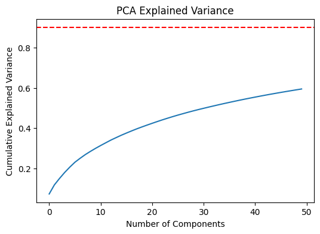
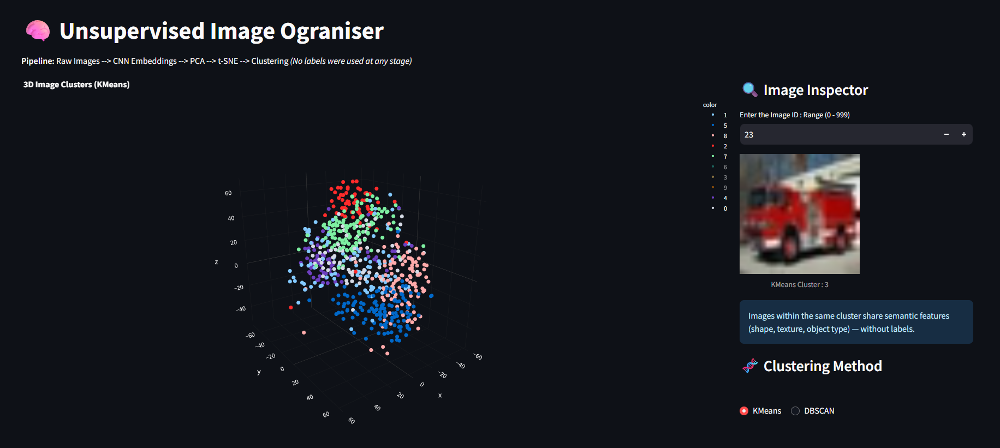

# 🧠 The Unsupervised Image Organizer

**Visualizing High-Dimensional Image Clusters using CNN Embeddings, PCA & t-SNE**

<p align="center">
  
  
  
  
</p>

> **Goal:**  
> Take a messy pile of unlabeled images and automatically organize them into meaningful visual groups — without using a single label — and explore those groups interactively in 3D.

Here I Have Used CIFAR-10 Dataset, it has 10000 images, but i have considered only first 1000 images,  
**Link 👉**
[Click Here](https://www.kaggle.com/c/cifar-10)

This project demonstrates how **semantic structure can emerge from data alone** by combining deep feature extraction, dimensionality reduction, and unsupervised clustering, packaged as a fast, interactive system.

---

## 🚀 Why This Project Matters


**Insted of Doing Clustering Tabular Data, Static 2D Plots, We can be**
- Working with a **unstructured image data**
- Using a **pre-trained CNN as a feature extractor**
- Separating **modeling**, **visualization**, and **deployment**
- Building an **interactive system**

The result feels closer to a lightweight, unsupervised version of *Google Photos clustering* — but built from first principles.

---

## 🧩 High-Level Pipeline


```
Raw Images
      ↓
CNN Feature Extraction (MobileNetV2)
      ↓
1280-D Semantic Embeddings
      ↓
PCA (Noise Filtering & Compression)
      ↓
t-SNE (3D Visualization Space)
      ↓
Unsupervised Clustering (K-Means / DBSCAN)
      ↓
Interactive 3D Exploration (Streamlit + Plotly)
```

Each stage is intentionally isolated so the system is:
- **Debuggable**
- **Reproducible**
- **Fast at runtime**

---

## 📁 Repository Structure

```
unsupervised-image-organizer/
│
├── app/
│   ├── app.py                  # Streamlit application
│   ├── image_data.npy          # Raw images (runtime artifact)
│   ├── pca_features.npy        # PCA-compressed embeddings
│   ├── tsne_3d.npy             # 3D visualization coordinates
│   └── image_features.npy      # CNN embeddings
│
├── notebooks/
│   ├── 01_feature_extraction.ipynb
│   ├── 02_dimensionality_reduction.ipynb
│   └── 03_clustering.ipynb
│
├── assets/
│   └── pipeline_diagram.png
│
├── viz_data.csv                # Final visualization + cluster metadata
├── requirements.txt
├── README.md
└── LICENSE
```

**Design choice:** Heavy computation happens once in notebooks. The Streamlit app only loads artifacts → no recomputation, fast UX.

---

## 🧠 Key Design Decisions (Engineering Rationale)

### 🔹 Why not cluster raw pixels?

Pixel distances are extremely fragile — a 1-pixel shift completely changes the math.

**Fix:** Use a pre-trained CNN to extract semantic embeddings that encode:
- Texture
- Shape
- Object parts
- Visual context

### 🔹 Why MobileNetV2?

- Lightweight and fast
- Pre-trained on ImageNet
- Excellent trade-off between speed and semantic quality
- Ideal for feature extraction, not classification

### 🔹 Why PCA before t-SNE?

- t-SNE is slow and unstable in very high dimensions
- PCA removes noise and compresses global structure
- PCA acts as a semantic filter, not just a math trick

**PCA is used here as meaning compression, not visualization.**

### 🔹 Why not cluster on t-SNE output?

t-SNE distorts global distances and is not mathematically suitable for clustering.

**Correct approach:**
- Cluster in PCA space
- Visualize in t-SNE space




---

## 🔍 Clustering Strategy

### K-Means
- Forces a fixed number of clusters
- Useful for testing whether embeddings naturally separate into groups
- Provides stable, interpretable partitions


### DBSCAN
- Density-based clustering
- No need to specify number of clusters
- Naturally detects outliers and ambiguous images

**Using both highlights the difference between:**
- *Forcing structure* vs *discovering structure*

---

## 🖥️ Interactive Application



The Streamlit app provides:

✨ 3D interactive visualization (Plotly)  
🎨 Color-coded clusters  
🔍 Hover-based inspection  
🔎 Manual image lookup via ID  
🔄 Toggle between clustering strategies

This turns abstract embeddings into human-interpretable insight.

---

## ⚙️ Tech Stack

| Component | Technology |
|-----------|-----------|
| Deep Learning | TensorFlow / Keras |
| Feature Extraction | MobileNetV2 (pre-trained) |
| Dimensionality Reduction | PCA, t-SNE |
| Clustering | K-Means, DBSCAN |
| Data Processing | NumPy, Pandas |
| Visualization | Plotly (3D interactive) |
| Deployment | Streamlit |

---

## ▶️ Running the App Locally


1. **Clone the repository**
   ```bash
   git clone [LINK](https://github.com/Shreyas-S-809/Unsupervised-Image-Organizer)
   cd Unsupervised-Image-Organiser
   ```

2. **Initialize and Activate Virtual Environment**
   ```powershell
   # Create environment
   python -m venv en

   # Activate (Windows)
   en\Scripts\activate
   ```

3. **Install Dependencies**
   ```bash
   pip install -r requirements.txt
   ```

4. **Run the Application**
   ```bash
   streamlit run app/app.py
   ```

All heavy ML computation is already done — the app loads instantly.


---

## 📌 Possible Extensions

- Swap CIFAR-10 for a custom image dataset
- Add cluster filtering & search
- Introduce a feedback loop for human-in-the-loop refinement
- Replace t-SNE with UMAP for faster scaling
- Deploy with Docker / Hugging Face Spaces

---

## 🏁 Final Note

This project was intentionally designed to show that:

> **Unsupervised learning is not about accuracy — it is about structure, assumptions, and interpretation.**

---

## 📝 License

This project is licensed under the MIT License - see the LICENSE file for details.

---

**Built with 🧠 and ☕**
**Thank You! 🙌**