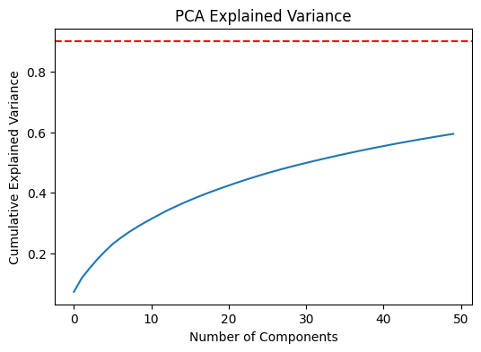
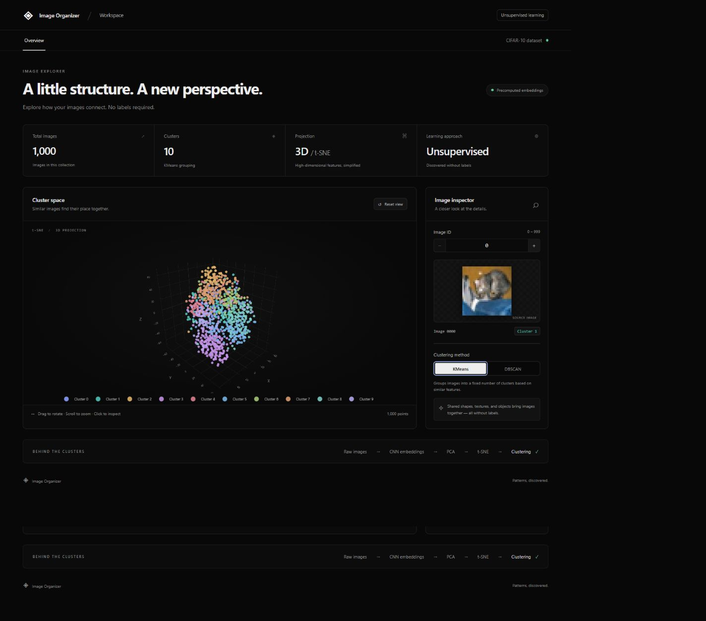

# 🧠 The Unsupervised Image Organizer

**Visualizing High-Dimensional Image Clusters using CNN Embeddings, PCA & t-SNE**

<p align="center">
  
  
  
  
</p>

> **Goal:**  
> Take a messy pile of unlabeled images and automatically organize them into meaningful visual groups — without using a single label — and explore those groups interactively in 3D.

Here I Have Used CIFAR-10 Dataset, it has 10000 images, but i have considered only first 1000 images,  
**Link 👉**
[Click Here](https://www.kaggle.com/c/cifar-10)

This project demonstrates how **semantic structure can emerge from data alone** by combining deep feature extraction, dimensionality reduction, and unsupervised clustering, packaged as a fast, interactive system.

---

## 🚀 Why This Project Matters


**Insted of Doing Clustering Tabular Data, Static 2D Plots, We can be**
- Working with a **unstructured image data**
- Using a **pre-trained CNN as a feature extractor**
- Separating **modeling**, **visualization**, and **deployment**
- Building an **interactive system**

The result feels closer to a lightweight, unsupervised version of *Google Photos clustering* — but built from first principles.

---

## 🧩 High-Level Pipeline


```
Raw Images
      ↓
CNN Feature Extraction (MobileNetV2)
      ↓
1280-D Semantic Embeddings
      ↓
PCA (Noise Filtering & Compression)
      ↓
t-SNE (3D Visualization Space)
      ↓
Unsupervised Clustering (K-Means / DBSCAN)
      ↓
Interactive 3D Exploration (HTML, CSS, JavaScript + Plotly)
```

Each stage is intentionally isolated so the system is:
- **Debuggable**
- **Reproducible**
- **Fast at runtime**

---

## 📁 Repository Structure

```
unsupervised-image-organizer/
│
├── app/
│   ├── app.py                  # Python artifact server
│   ├── static/                # HTML, CSS and JavaScript interface
│   ├── pca_features.npy        # PCA-compressed embeddings
│   ├── tsne_3d.npy             # 3D visualization coordinates
│   └── image_features.npy      # CNN embeddings
│
├── notebooks/
│   ├── 01_feature_extraction.ipynb
│   ├── 02_dimensionality_reduction.ipynb
│   └── 03_clustering.ipynb
│
├── assets/
│   └── pipeline_diagram.png
│
├── image_data.npy             # Raw images (runtime artifact)
├── viz_data.csv                # Final visualization + cluster metadata
├── requirements.txt
├── README.md
└── LICENSE
```

**Design choice:** Heavy computation happens once in notebooks. The Python server only loads artifacts → no recomputation, fast UX.

***This project is fully containerized, please refer to the Docker commands below.***
---

## 🧠 Key Design Decisions (Engineering Rationale)

### 🔹 Why not cluster raw pixels?

Pixel distances are extremely fragile — a 1-pixel shift completely changes the math.

**Fix:** Use a pre-trained CNN to extract semantic embeddings that encode:
- Texture
- Shape
- Object parts
- Visual context

### 🔹 Why MobileNetV2?

- Lightweight and fast
- Pre-trained on ImageNet
- Excellent trade-off between speed and semantic quality
- Ideal for feature extraction, not classification

### 🔹 Why PCA before t-SNE?

- t-SNE is slow and unstable in very high dimensions
- PCA removes noise and compresses global structure
- PCA acts as a semantic filter, not just a math trick

**PCA is used here as meaning compression, not visualization.**

### 🔹 Why not cluster on t-SNE output?

t-SNE distorts global distances and is not mathematically suitable for clustering.

**Correct approach:**
- Cluster in PCA space
- Visualize in t-SNE space




---

## 🔍 Clustering Strategy

### K-Means
- Forces a fixed number of clusters
- Useful for testing whether embeddings naturally separate into groups
- Provides stable, interpretable partitions


### DBSCAN
- Density-based clustering
- No need to specify number of clusters
- Naturally detects outliers and ambiguous images

**Using both highlights the difference between:**
- *Forcing structure* vs *discovering structure*

---

## 🖥️ Interactive Application



The responsive, Vercel-inspired dark interface provides:

- 3D interactive visualization (Plotly)
- Color-coded clusters
- Manual image lookup via ID
- Toggle between clustering strategies
- Click a point to inspect its image, or use the image ID controls
- Reset the 3D camera view
- Find six similar images using cosine similarity of the saved CNN embeddings (excluding the selected image)
- Browse six representatives nearest each cluster mean in PCA space; click any thumbnail to inspect it

Similarity is not classification confidence. DBSCAN noise is excluded from contact sheets; the current saved DBSCAN results contain only noise. Discovery results are computed once per server process and cached. No model retraining or extra dependencies are needed.

This turns abstract embeddings into human-interpretable insight.

---

## ⚙️ Tech Stack

| Component | Technology |
|-----------|-----------|
| Deep Learning | TensorFlow / Keras |
| Feature Extraction | MobileNetV2 (pre-trained) |
| Dimensionality Reduction | PCA, t-SNE |
| Clustering | K-Means, DBSCAN |
| Data Processing | NumPy, Pandas |
| Visualization | Plotly (3D interactive) |
| Interface | HTML, CSS, vanilla JavaScript |
| Server | Python HTTP server (local / Docker) |

---

## ▶️ Running the App Locally


1. **Clone the repository**
   ```bash
   git clone https://github.com/Shreyas-S-809/Unsupervised-Image-Organizer
   cd Unsupervised-Image-Organizer
   ```

2. **Initialize and Activate Virtual Environment**
   ```powershell
   # Create environment
   python -m venv en

   # Activate (Windows)
   en\Scripts\activate
   ```

3. **Install Dependencies**
   ```bash
   pip install -r requirements.txt
   ```

4. **Run the Application**
   ```bash
   python app/app.py
   ```

Open http://localhost:8501. All heavy ML computation is already done; the interface uses the existing artifacts. Plotly is served locally, so no external CDN is needed.

The HTML, CSS and JavaScript live in `app/static/`. Python serves the saved data and image previews; the notebooks and ML pipeline are unchanged.

5. **OR Run it using Docker**

First, build the updated image:

   ```bash
   docker build -t image-organizer .
   ```
Next, Start the container. Make sure to map the ports correctly to `8501`

  ```bash
  docker run --rm -p 8501:8501 image-organizer
  ```
Once the container is running, open your web browser and navigate to:
  http://localhost:8501

> _(Note: The terminal might output a link to `0.0.0.0.:8501`. If you are windows, Browsers cannot route to `0.0.0.0`, so always use `localhost` instead!)._
---

## 🚀 Deployment

The HTML/CSS/JavaScript version runs locally or in the Docker container above. The previous Streamlit Cloud deployment does not serve this new interface.

All computationally heavy steps (CNN feature extraction, PCA, t-SNE, clustering) remain offline in the notebooks. The server reads the existing `.npy` and `.csv` artifacts without recomputing or changing them.

---

## 📌 Possible Extensions

- Swap CIFAR-10 for a custom image dataset
- Add cluster filtering & search
- Introduce a feedback loop for human-in-the-loop refinement
- Replace t-SNE with UMAP for faster scaling
- Deploy with Docker / Hugging Face Spaces

---

## 🏁 Final Note

This project was intentionally designed to show that:

> **Unsupervised learning is not about accuracy — it is about structure, assumptions, and interpretation.**

---

## 📝 License

This project is licensed under the MIT License - see the LICENSE file for details.

---

**Built with 🧠 and ☕**
**Thank You! 🙌**
